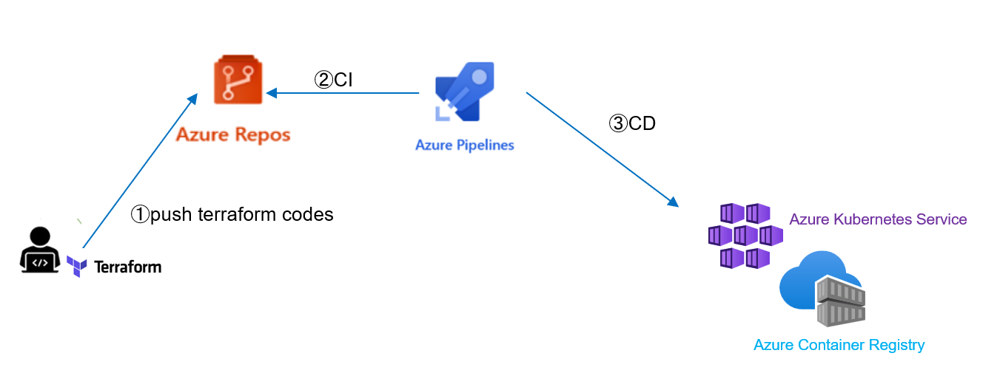
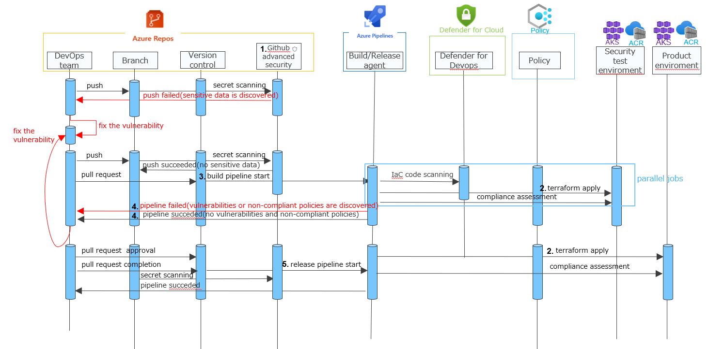
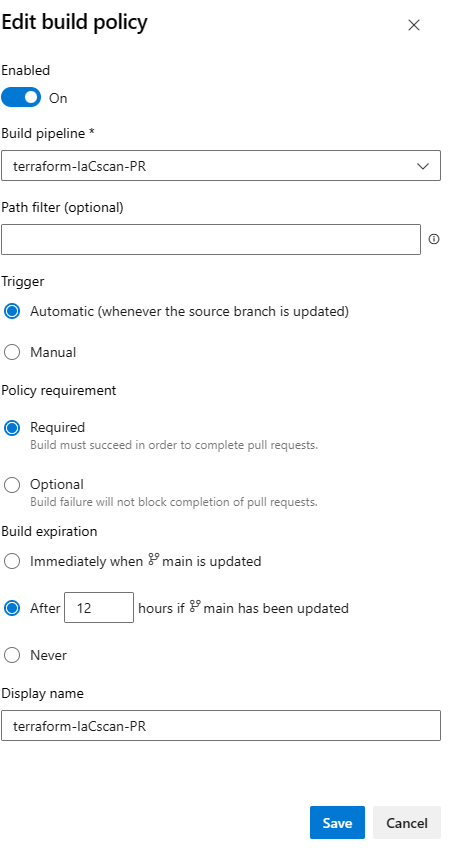
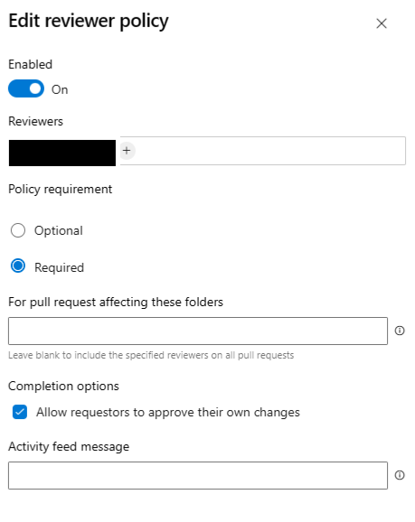

# IaC(terraform)のCI/CD(Azure DevOps Service)におけるセキュリティテスト

## 概要
Azure DevOps Serviceを使用したCI/CDでIaC(terraform)のセキュリティテストを組み込む例について、説明します。

## CI/CD 環境構成
Azure DevOps Serviceの一部のReposとPipelinesを使用し、AKSとACRがデプロイされます。



## セキュリティテストに使用するサービス
### [Github advanced security](https://learn.microsoft.com/en-us/azure/devops/repos/security/configure-github-advanced-security-features?view=azure-devops&tabs=yaml)
Azure DevOpsに統合されており、シークレットスキャンに使用します。
> [2023 年 9 月 20 日より、Azure DevOps 用 Microsoft Security DevOps (MSDO) 拡張機能内のシークレット スキャン (CredScan) ツールは非推奨になりました。 MSDO シークレットのスキャンは、Azure DevOps 用の GitHub Advanced Security に置き換えられます。](https://learn.microsoft.com/en-us/azure/defender-for-cloud/azure-devops-extension)

### [Azure Policy](https://learn.microsoft.com/en-us/azure/governance/policy/overview)
[deployment gates](https://learn.microsoft.com/en-us/azure/devops/pipelines/release/approvals/gates?view=azure-devops)に組み込み、IaCのコンプライアンス評価で使用します。

### [Azure Defender for Devops](https://learn.microsoft.com/en-us/azure/defender-for-cloud/defender-for-devops-introduction)

IaCのコードスキャンに使用します。

## IaC(terraform)のCI/CDにおけるセキュリティテスト
### セキュリティテストのフロー図とそれぞれの説明
下図は、IaCのCICDにおけるセキュリティテストのフローを示しています。



#### 1. Github advanced security
シークレットスキャンの設定方法について,  [シークレットスキャンの設定](https://learn.microsoft.com/en-us/azure/devops/repos/security/configure-github-advanced-security-features?view=azure-devops&tabs=yaml#set-up-secret-scanning)を参照してください。

#### 2. terraform apply
デプロイに使用されるterraformコードについて、[こちら](https://github.com/windagecat/IaC-cicd-securitytest-JP-/tree/main/codes/Azure)を参照してください。<br>
>セキュリティテストの流れの説明のため、テストをパスできる修正されたterraformコードは用意していません。

事前にtfstate保存用にAzure Storageが必要です。<br>
その設定方法について、下記に示します。
```bash
# securitytest environmentのためのtfstate保存用のstorage作成
## ./codes/securitytest-tfstateへの移動
cd ./codes/securitytest-tfstate
## terraform.vars(必要であれば)の編集
## terraform initの実行
terraform init
## terraform applyの実行
terraform apply

# product environmentのためのtfstate保存用のstorage作成
## ./codes/product-tfstateへの移動
cd ./codes/product-tfstate
## terraform.vars(必要であれば)の編集
## terraform initの実行
terraform init
## terraform applyの実行
terraform apply
```

#### 3. build pipeline start
IaCのコードスキャンについて、[azure-pipelines-IaCsecurityscan.yml](./codes/azure-pipelines-IaCsecurityscan.yml).を参照してください。
>事前に[Defender for DevOps](https://learn.microsoft.com/en-us/azure/defender-for-cloud/quickstart-onboard-devops)と[PR注釈](https://learn.microsoft.com/en-us/azure/defender-for-cloud/enable-pull-request-annotations#enable-pull-request-annotations-in-azure-devops) の設定が必要です。

 IaCのコンプライアンス評価について, [IaCのコンプライアンス評価](./codes/compliance_assessment_pipeline.md)を参照してください。

#### 4. pipeline failed(vulnerabilities or non-compliant policies are discovered) and pipeline succeded(no vulnerabilities and non-compliant policies)
ブランチポリシーにより、IaCのコードスキャンが失敗した場合は、プルリクエスト完了できない。



Reviewer policyにより、特定の承認者が承認しない限り、プルリクエスト完了できない。
> コンプライアンス評価のパイプラインについて、ブランチポリシーで制御できないため、Reviewer policyで制御するようにしています。




#### 5. release pipeline start
[Release pipeline](./codes/release_pipeline.md)を参照してください。


以上で、説明を終わります。<br>
DevSecOpsの一貫として、本番環境(product environment)へデプロイ後も、継続監視は必要です。
Defender for Cloud (構成ミスや脅威監視など)を使用して、継続監視が可能です。